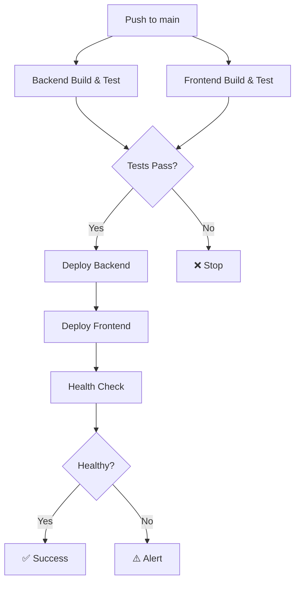

# CI/CD Pipeline Overview

## 🚀 Quick Start

### 1. Set Up GitHub Secrets

Copy values from `.github/secrets.template` to:

```
Repository → Settings → Secrets and variables → Actions → New repository secret
```

### 2. Trigger Deployment

```bash
git add .
git commit -m "deploy: trigger CI/CD pipeline"
git push origin main
```

### 3. Monitor Progress

```
GitHub → Actions → CI/CD Pipeline
```

---

## 📊 Pipeline Stages



---

## ⏱️ Expected Duration

| Stage                 | Duration      |
| --------------------- | ------------- |
| Backend Build & Test  | ~2-3 min      |
| Frontend Build & Test | ~2-3 min      |
| Deploy Backend        | ~3-5 min      |
| Deploy Frontend       | ~2-3 min      |
| Health Check          | ~30 sec       |
| **Total**             | **~8-12 min** |

---

## 🔐 Required Secrets (9 total)

| Secret                            | Source                | Required    |
| --------------------------------- | --------------------- | ----------- |
| `MONGODB_URI`                     | MongoDB Atlas         | ✅          |
| `JWT_SECRET`                      | Generated             | ✅          |
| `OPENAI_API_KEY`                  | OpenAI Platform       | ✅          |
| `AZURE_STORAGE_CONNECTION_STRING` | Azure Storage         | ✅          |
| `AZURE_BACKEND_APP_NAME`          | Azure App Service     | ✅          |
| `AZURE_WEBAPP_PUBLISH_PROFILE`    | Azure Portal          | ✅          |
| `AZURE_STATIC_WEB_APPS_API_TOKEN` | Azure Static Web Apps | ✅          |
| `FRONTEND_URL`                    | Your frontend URL     | ✅          |
| `APPINSIGHTS_INSTRUMENTATIONKEY`  | Azure App Insights    | ⚠️ Optional |

See `.github/DEPLOYMENT_GUIDE.md` for detailed setup instructions.

---

## 📝 Workflow Features

### ✅ Build Phase

- Node.js 20.x with npm caching
- ESLint code quality checks
- Parallel backend + frontend testing
- Test coverage reports
- Build artifacts

### ✅ Test Phase

- **Backend:** Jest + MongoDB Memory Server
- **Frontend:** Vitest + React Testing Library
- Code coverage thresholds
- Test result artifacts

### ✅ Deploy Phase

- Backend → Azure App Service (Linux, Node 20)
- Frontend → Azure Static Web Apps (CDN)
- Environment variables configuration
- Automatic rollback on failure

### ✅ Verify Phase

- Backend health endpoint check
- Frontend accessibility check
- Deployment notifications
- Artifact cleanup

---

## 🔧 Maintenance

### Update Node Version

```yaml
# In .github/workflows/deploy.yml
env:
  NODE_VERSION: "20.x" # Change here
```

### Add New Environment Variable

1. Add to GitHub Secrets
2. Add to workflow:

```yaml
- name: ⚙️ Configure Azure App Settings
  with:
    app-settings-json: |
      [
        {
          "name": "NEW_VAR",
          "value": "${{ secrets.NEW_VAR }}",
          "slotSetting": false
        }
      ]
```

### Disable Deployment (Tests Only)

Comment out deploy jobs:

```yaml
# deploy-backend:
#   ...
# deploy-frontend:
#   ...
```

---

## 🐛 Troubleshooting

### Pipeline Fails at Test Stage

```bash
# Run tests locally:
cd backend && npm test
cd frontend && npm test

# Check test logs in GitHub Actions
```

### Pipeline Fails at Deploy Stage

```bash
# Verify secrets are set:
Repository → Settings → Secrets → Check all required secrets

# Re-download publish profile if expired:
Azure Portal → App Service → Download publish profile
```

### Health Check Fails

```bash
# Check backend manually:
curl https://your-backend.azurewebsites.net/api/health

# Check Azure logs:
az webapp log tail --name your-backend --resource-group your-rg
```

---

## 📚 Documentation

- **Detailed Guide:** `.github/DEPLOYMENT_GUIDE.md`
- **Secrets Template:** `.github/secrets.template`
- **Workflow File:** `.github/workflows/deploy.yml`

---

## ✅ Success Checklist

Before first deployment:

- [ ] All 9 GitHub Secrets configured
- [ ] Azure resources created (App Service, Static Web Apps, Storage)
- [ ] MongoDB Atlas database set up
- [ ] CORS configured in App Service
- [ ] Tests passing locally
- [ ] Health endpoint responding

After deployment:

- [ ] Backend API accessible
- [ ] Frontend loads correctly
- [ ] Can register/login
- [ ] Can create assignment
- [ ] AI chat works
- [ ] File upload works

---

**Need Help?** See `.github/DEPLOYMENT_GUIDE.md` for comprehensive setup instructions.
